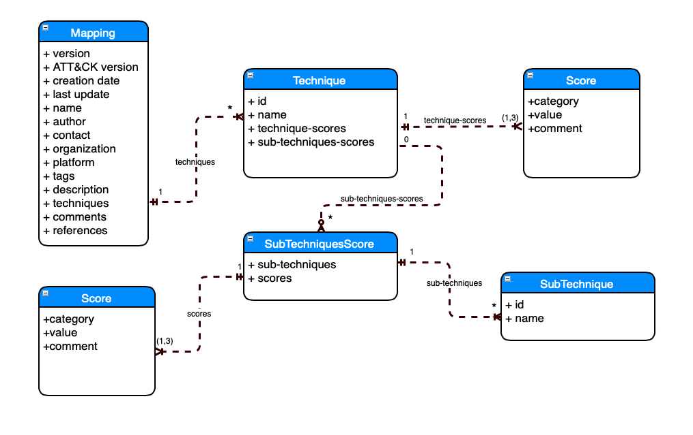

# Mapping Format

Below is the structure of the data format that captures the details of how a security control maps to ATT&CK (sub-)techniques.  The type, description and required attributes of each field are provided in the subsequent sections along with an example mapping file.



*Above:  Entity Diagram for Data Mapping Format*

## Data Dictionary
### Top Level Metadata Fields
 
| Name | Type | Required | Description |
|------|------|----------|-------------|
| version | String | yes | The version of the data mapping format used in this mapping file. |
| ATT&CK version | String |	yes | The version of the ATT&CK (Enterprise) matrix used to source the (sub-)techniques included in this mapping file. |
| creation date | String | yes | Creation time of this mapping file.<br /> Format:  1/21/2021 |
| last update | String | no | Last update time of this mapping file.<br /> Format:  1/21/2021 |
| name | String | yes |	The name of the security control being mapped in this file. |
| author | String | no | The author of this mapping file. |
| contact | String | no | The email address of the author of this mapping file. |
| organization | String | no | The organization that produced this mapping file. |
| platform | String | yes | The platform of the security control being mapped in this file. <br /> Ex:  Azure, AWS, Windows, etc. |
| tags | List of Strings | no | Will enable the mapping tool to produce visualizations (e.g. ATT&CK Navigator) by aggregating security controls by these tag values. <br /> Ex:  Produce an ATT&CK Navigator layer for all security controls tagged with "Azure AD". |
| description | String | yes | The description of the security control |
| techniques | List of Technique objects <br /> List Size:  [1-*] | yes |List of technique objects that describe the ATT&CK techniques that the control is able to offer protection. |
| comments | String | no | Document any assumptions or comments on the mapping. |
| references | List of URLs | no	| A list of links to documentation helpful in understanding the data contained in this mapping. <br /> Ex:  A link to the documentation for the security control |


### Technique Object Fields

A technique object describes an ATT&CK technique that the security control provides protection against.
 
| Name | Type | Required | Description |
|------|------|----------|-------------|
|id | String | yes | The ID of the ATT&CK technique. |
| name | String | yes |The name of the ATT&CK technique. |
| technique-scores | List of Score objects <br /> List Size: [1-3] | yes | The list of Score objects that enables assessing the effectiveness of the prevent, detect, and/or respond protections provided by the security control for this ATT&CK technique. |
| sub-techniques-scores	| List of SubTechniquesScore objects <br /> List Size:  [1-*] | no | This list of SubTechniquesScore objects that describe the specific sub-techniques of this technique that this control provides protection against. If the ATT&CK technique supports sub-techniques, this field is mandatory.|


### SubTechniquesScore Object Fields
 
A score object describes the assessment (score) of the effectiveness of the prevent, detect, and/or response protections provided by the security control for the list of ATT&CK sub-techniques included in this object.
 
| Name | Type | Required | Description |
|------|-------|---------|-------------|
| sub-techniques | List of sub-technique id and name tuples. | yes | The list of sub-techniques, identified by their id and name fields, that the scores field in this object apply to.  The length of this list should be at least one, i.e. at least one sub-technique must be in the list.  This field supports providing a score for a group of sub-techniques rather than having to provide it for each sub-technique individually. |
| scores | List of Score objects <br /> List Size: [1-3] | yes | The list of score objects that describe the type of protection provided by this control to the specified sub-techniques. |


### Score Object Fields
A score object describes the assessment (score) of the effectiveness of the prevent, detect, and/or response protections provided by the security control for this ATT&CK (sub-)technique.
 
| Name | Type | Required | Description |
|------|------|----------|-------------|
| category | String | yes | The control category. <br /> Valid values:  [Prevent, Detect, Respond] |
| value | String | yes | The [score](scoring.md) <br /> Ex:  (Minimal, Partial, Significant) |
| comments | String | no | A justification for the assessed score or any related comments. |


## Example Mapping 

```
version: 1.0
ATT&CK version: 8.1
creation date: 1/21/2021
name: Azure Active Directory Password Protection
author: 
contact: ctid@mitre-engenuity.org
organization: Center for Threat Informed Defense (CTID)
platform: Azure
tags: 
  - Identity
  - Azure Active Directory
  - Passwords
  - Credentials
description: > 
  Azure AD Password Protection detects and blocks known weak passwords and their variants, 
  and can also block additional weak terms that are specific to your organization.
  Azure AD Password Protection provides a global banned password list that is
  automatically applied to all users in an Azure AD tenant.  The Azure AD
  Identity Protection team constantly analyzes Azure AD security telemetry data
  looking for commonly used weak or compromised passwords.  When weak terms are
  found, they're added to the global banned password list. To support your own
  business and security needs, you can define entries in a custom banned 
  password list. When users change or reset their passwords, these banned 
  password lists are checked to enforce the use of strong passwords.
techniques:
  - id: T1110
    name: Brute Force
    technique-scores:
      - category: Prevent
        value: Partial
    sub-techniques-scores:
      - sub-techniques:
        - id: T1110.001
          name: Password Guessing
        - id: T1110.002
          name: Password Cracking
        - id: T1110.003
          name: Password Spraying
        - id: T1110.004
          name: Credential Stuffing
        scores:
          - category: Prevent
            value: Partial
comments: >
  All scores have been assessed as Partial because this control increases the
  strength of user passwords thereby reducing the likelihood of a successful
  brute force attack.  Due to the fact that a user's password is not checked 
  against the banned list of passwords unless the user changes or resets their 
  password (which is an infrequent event), there is still ample opportunity 
  for attackers to utilize this technique to gain access. This is what prevented
  the score from being elevated to Significant.
references:
  - https://docs.microsoft.com/en-us/azure/active-directory/authentication/concept-password-ban-bad
```
